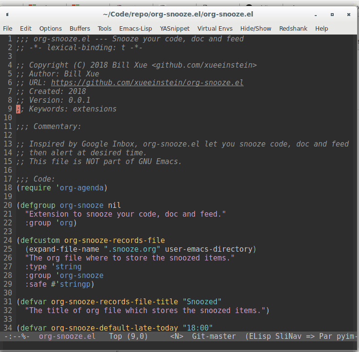

# org-snooze.el

Snooze your code, doc, feed in Emacs

## Demo

## Installation

The package can be installed via MELPA. The package name is **org-snooze**.

## How to Use

Focus on the active file buffer, then use `M-x org-snooze`. It would asks you to set a snooze time.
Then Emacs would remind you at the given time through [Emacs appointment reminders](https://www.gnu.org/software/emacs/manual/html_node/org/Weekly_002fdaily-agenda.html#Weekly_002fdaily-agenda)
(**appt.el**). You can edit other files after that. When it is at your setting time, you get a
notification. Finally, use `M-x org-snooze-pop` to get back to your snoozed file at the line where you leave.
`M-x org-snooze-pop` always pops the most recently alerted but unprocessed snoozed item.

Note that if you want some fancy functionality like system notification and sound alert.
Please check my **appt** config at [here](https://github.com/xueeinstein/emacs.d/blob/98209180873fefc0172e24dd23165ab872faab93/lisp/init-org.el#L419).
